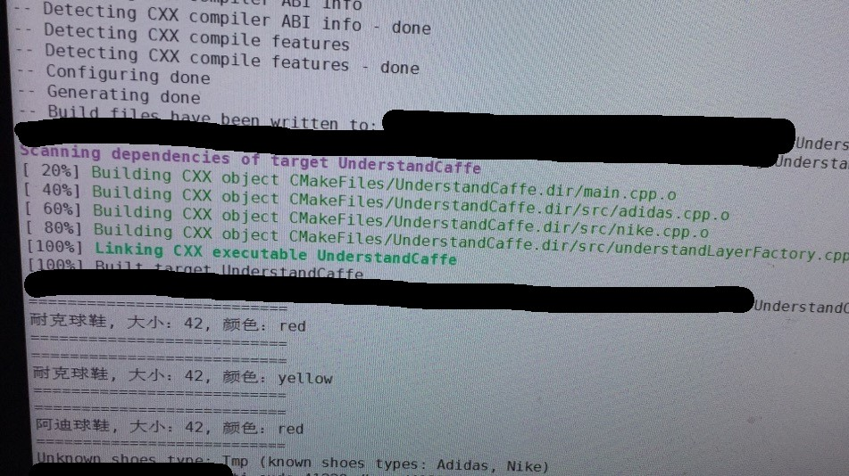
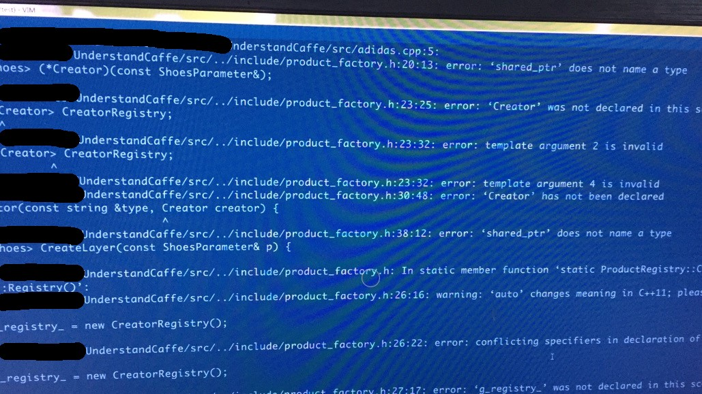
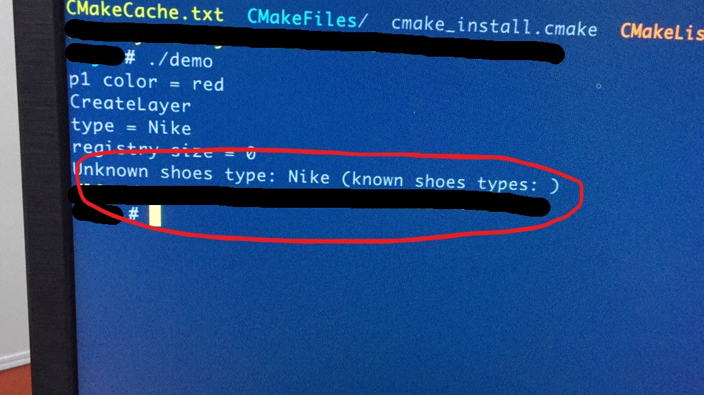

# UnderstandCaffe
Blogs about Caffe

I only test this project in linux, with the gcc version 4.9.4 or 5.4.0

The demo output is:

## Issue

1. If you use other gcc like 4.9.2, you cannot build the project correctly. 

2. Although you build the project successfully, the pre-defined classes may not be registered.

The mentioned two issues are not solved. If you have answers, please contact me changshuo@bupt.edu.cn
